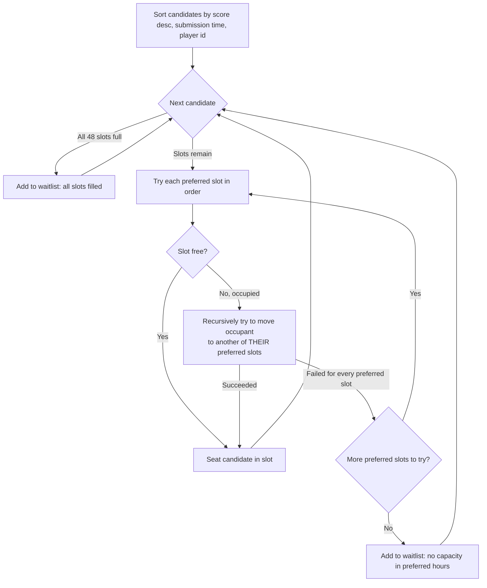

## SvS Prep Scheduler

Right now, we can configure the SvS points from the form inputs, including:
- Points per FC
- Points per RFC
- Points per FC Shard
- Construction speedup per minute
- Research speedup per minute
- Days-to-minutes conversion (by default, 1 day = 1,440 minutes). This conversion is important because the players' form responses are based on days, while the points for construction and research speedups are calculated using speedup minutes.

The algorithm assigns spots based on the potential points that each player can earn according to their form responses. These points are then used as a priority queue to determine the allocation.

### Scheduling Algorithm

Spots are filled per day using augmenting-path bipartite matching (a variant of Kuhn's algorithm), processing players strictly in priority order (score desc, then earliest submission, then player id). A greedy "first free slot" approach can waste capacity: a flexible player (many preferred hours) might occupy a slot that a stricter, higher-priority player needed as their only option. Instead, when a candidate's preferred slots are all taken, the algorithm tries to bump the current occupant into another slot from *that occupant's own* preferences, recursively, before giving up. Occupants are only ever moved, never unseated, so priority order is always preserved and no reachable capacity is left unused.



### Overview Dashboard

The home page is a dashboard summarizing all imported data: total players, slots filled vs. open, waitlist size, and alliance participation, plus charts for slots filled per day, waitlist size per day, players per alliance, requested days, and priority score per alliance.
### CSV Import

We can import the data from a .csv file. We only need to export the “Formularantworten 1” sheet as a .csv from the Excel Kopie von SVS Prep Signup Template (Antworten) file and upload it to the web app.

A sample CSV is available to download directly from the Import page for anyone who wants to try the app without their own sign-up data.

Once the file is processed, the app will clear the previous data and populate the application with the new data from the imported file.
### Players

There is a list of all players who filled out the form. We can search for players by:

- Name
- ID
- Alliance

Clicking on a player opens a detail modal containing the information submitted by that player, as well as their potential score based on their responses.
### Monday, Tuesday, and Thursday (Duty Board)

There is a separate page for each day. Each page contains a table showing the assigned spots for that day.

The tables can be filtered by alliance, and there is header information with a summary of how many slots each alliance has taken.

There is also a waitlist. If a player who filled out the form does not get a spot, they are added to the waitlist. The waitlist includes an explanation of why the player did not get a spot, for example, “No capacity in preferred hours.”

like the player view, we can click on a player's name to open a detail modal showing the information they submitted in the form.
### Automated Allocation and Manual Editing

The web app automatically assigns spots based on each player's potential score and their preferred hours.

However, the assigned data can also be edited manually. We will be able to:

- Swap spots between players in the table.
- Move/swap players between the table and the waitlist.
- Manually adjust the assigned spots when needed.
### Output Messages

A dedicated page generates copy-paste-ready messages for each alliance's R4/R5 to send to their scheduled chiefs, grouped by day. Messages are automatically split into multiple parts to stay under a 250 character limit, and can be filtered by day or alliance.

## Built with

- TanStack Start
- TypeScript
- React
- Tailwind CSS

## Running Locally

### Prerequisites

- [Bun](https://bun.sh) (this project uses `bun.lock`/`bunfig.toml` for package management)

### Setup

1. Clone the repository and install dependencies:

   ```sh
   bun install
   ```

2. Create a `.env` file in the project root with your Supabase credentials:

   ```env
   SUPABASE_PROJECT_ID="<your-project-id>"
   SUPABASE_PUBLISHABLE_KEY="<your-publishable-key>"
   SUPABASE_URL="<your-supabase-url>"
   VITE_SUPABASE_PROJECT_ID="<your-project-id>"
   VITE_SUPABASE_PUBLISHABLE_KEY="<your-publishable-key>"
   VITE_SUPABASE_URL="<your-supabase-url>"
   ```

3. Start the dev server:

   ```sh
   bun run dev
   ```

   The app will be available at `http://localhost:8080/`.

### Other scripts

- `bun run build` — build for production
- `bun run preview` — preview the production build
- `bun run lint` — lint the codebase
- `bun run format` — format the codebase with Prettier